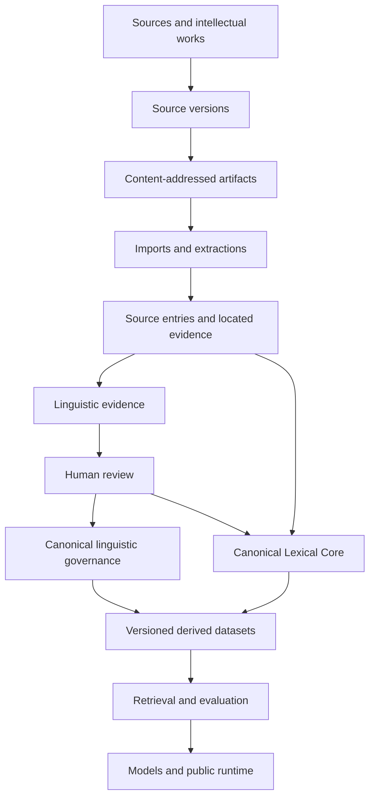
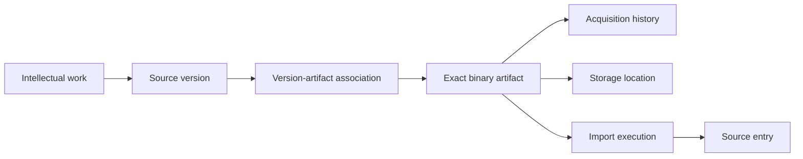

# Project Tafsiri

> **Dialect-aware language research and AI infrastructure for the Luhya language family.**

[](https://github.com/Global-Data-Science-Institute/project-tafsiri/actions/workflows/ci.yml)

Project Tafsiri is an initiative of the [Global Data Science Institute](https://www.gdsi.institute/) building trustworthy language resources, research workflows, and future AI infrastructure for Luhya varieties.

Its long-term directions are **English ↔ Luhya dialects**, **Swahili ↔ Luhya dialects**, and **dialect ↔ dialect**. These translation systems are goals. The repository currently provides governed research infrastructure: provenance, exact artifact identity, rights records, linguistic evidence, human review, canonical governance, evaluation, and the Reviewer Portal. A public translation runtime and production translation model have not been released.

## Why Tafsiri exists

Luhya is a family of related varieties with distinct vocabulary, pronunciation, morphology, tone, usage, histories, and cultural contexts. Pooling them into one synthetic vocabulary can produce plausible language that is wrong for a speaker's dialect.

Tafsiri keeps dialect identity explicit throughout the data lifecycle. Linguistic relatedness informs comparison; it does not erase difference. The project asks how historical dictionaries, scholarship, community expertise, field materials, and machine-assisted extraction can contribute to language technology without losing provenance, uncertainty, rights context, or human accountability.

## Governing principles

### Dialects are first-class

Bukusu, Luwanga, Maragoli, Tsotso, Kisa, Idakho, Isukha, Tiriki, Samia, Marachi, Marama, Nyala, Tachoni, Khayo, Lunyore, Kabras, Wanga, and other documented varieties remain distinguishable. Tafsiri does not manufacture a generalized vocabulary by blending them.

### Evidence comes before generation

```mermaid
flowchart LR
    S[Source] --> V[Source version]
    V --> A[Exact artifact]
    A --> I[Import or extraction]
    I --> E[Source entry or evidence]
    E --> H[Human review]
    H --> C[Canonical knowledge]
    C --> D[Derived datasets]
    D --> R[Retrieval and evaluation]
    R --> M[Models and runtime]
```



Machine-generated candidates remain proposals. They do not automatically become human-verified evidence, canonical knowledge, training data, or runtime behavior. Unverified, disputed, historical, or unresolved evidence may remain visible without promotion.

### Language and communities require care

When no verified native equivalent or established borrowing exists, Tafsiri preserves the original term and explains it naturally in the requested dialect. It does not guess. Native speakers and community experts are partners in lexical review, pronunciation, cultural context, register, idioms, and governance.

## Architecture



A canonical rule is not automatically executable. A reviewed lexical assertion is not automatically a training example. An accessible source is not automatically licensed for every use.

### Source, version, artifact, and import lineage

Migration 010 introduced a boundary needed for reproducibility:



Different binaries can represent the same intellectual version. A Wanga dictionary version may have multiple PDF representations without becoming multiple editions. The Ndanyi and Ndanyi dictionary is one work represented by five ordered scan artifacts. SHA-256 identifies exact bytes; acquisitions record receipt; imports identify the artifact and parser that produced entries.

See [Source Artifact & Acquisition Architecture 001](docs/research/source-artifact-acquisition-architecture-001.md).

### Evidence, canonical knowledge, and runtime

Tafsiri distinguishes:

1. **Source evidence** — what a located source says.
2. **Human-verified evidence** — a reviewer confirms that evidence represents its source.
3. **Canonical knowledge** — a separately governed assertion with scope, evidence links, revisions, and lifecycle state.
4. **Runtime behavior** — an evaluated implementation approved for serving.

[Canonical Promotion Pilot 001](docs/research/canonical-promotion-pilot-001.md) validated this chain with four rules. All remain `PROVISIONAL`; none is automatically active at runtime.

### Canonical Lexical Core: next

The next major architecture milestone is:

```text
Lexeme → Form → Sense → Concept
```

A dictionary row is an attestation, not automatically a canonical word. The planned model supports homographs, multiple senses, dialect-specific and historical forms, variants, source attestations, concepts, disputed analyses, and explicit verification state. Migration 011 does not yet exist.

## Verified project state

The production state verified after Migration 010 and Marlo Source & Artifact Registration 001 is:

| Governed object | Count |
|---|---:|
| Sources | 59 |
| Source versions | 59 |
| Exact source artifacts | 12 |
| Version-artifact associations | 12 |
| Artifact acquisitions | 13 |
| Artifact sets / members | 1 / 5 |
| Current source rights | 59 |
| Current source-use policies | 472 |
| Linguistic evidence / human-verified | 110 / 110 |
| Canonical rules / provisional | 4 / 4 |

The newly registered Marlo package has zero import batches and zero source entries. No canonical lexical import has occurred.

### Delivery status

| Area | Status |
|---|---|
| Repository / CI | **COMPLETE** |
| Environment separation | **COMPLETE** |
| Canonical dialect registry | **COMPLETE** |
| Source provenance | **COMPLETE** |
| Rights/use-policy governance | **COMPLETE** |
| Scholarly literature registry | **COMPLETE** |
| Linguistic evidence architecture | **COMPLETE** |
| Initial extraction | **COMPLETE** |
| Human scholarly review | **COMPLETE** |
| Canonical rule governance | **COMPLETE** |
| Canonical Promotion Pilot 001 | **COMPLETE** |
| Source artifact architecture | **COMPLETE** |
| Migration 010 | **DEPLOYED** |
| Marlo Source Intake 001 | **COMPLETE** |
| Marlo Source & Artifact Registration 001 | **COMPLETE** |
| Canonical Lexical Core Architecture | **NEXT** |
| Lexical import | **NOT STARTED** |
| Runtime G2P/morphology | **PLANNED** |
| Training datasets | **DEFERRED** |
| Production model training | **DEFERRED** |
| Public translation runtime | **NOT RELEASED** |

## Michael Marlo source registration

Michael Marlo Source & Artifact Registration 001 is complete in staging and production. It reused the Bukusu and Wanga 2008 sources and versions; created six sources and six versions; registered 12 unique SHA-256 artifacts from 13 files; preserved duplicate Ndanyi Part 5 as one artifact and two acquisitions; created one five-part set; and created six `UNKNOWN` rights and 48 `UNKNOWN` use-policy records.

It created zero imports, source entries, dialect assertions, or canonical lexical records. Direct provision establishes acquisition provenance. It does not establish permission for model training, redistribution, public display, or commercial/API use. Those decisions remain `UNKNOWN`.

See [Michael Marlo Source & Artifact Registration 001](docs/research/marlo-source-artifact-registration-001.md).

## Reviewer Portal

The [Reviewer Portal](apps/reviewer-portal/README.md) is a research application for invited linguistic reviewers and administrators. It is not the public translation application.

Its stack is Next.js, React, TypeScript, PostgreSQL/Supabase, Supabase Auth, and Row-Level Security. It supports governed onboarding, assignments, blinded review stages, resume logic, withdrawal, administration, and auditable review state.

[Open the staging Reviewer Portal](https://tafsiri-reviewer-portal-staging.vercel.app/).

## Rights, ethics, and boundaries

| One fact | Does not imply |
|---|---|
| Possession of a source | A license to use it |
| Public accessibility | Permission for model training |
| Direct researcher sharing | Redistribution or public-display permission |
| Human review | Canonical promotion |
| Canonical knowledge | Runtime execution |

Use policies are recorded separately for internal research, human review, reviewer display, public display, redistribution, model training, benchmark publication, and commercial API use. Unknown permission remains `UNKNOWN`.

Software licensing is separate from rights in third-party source materials. The root `LICENSE` currently contains an incomplete Apache 2.0 placeholder and must be completed or replaced before the repository claims a finalized software license. No repository license grants rights in registered source artifacts.

## Cultural and community commitments

Project work should involve native speakers and qualified experts; preserve dialect variation and cultural context; document consent, attribution, provenance, and uncertainty; respect traditional or restricted knowledge; support fair compensation and capacity; and build community partnerships rather than extractive relationships.

Read the [Language Inclusion Framework](docs/language_inclusion_framework.md) and [Cultural Guidelines](docs/cultural_guidelines.md).

## Deliberate choices

Tafsiri has deliberately not:

- merged dialects into generic Luhya;
- promoted legacy dictionaries directly into canonical truth;
- trained a production model from unreviewed material;
- assumed training rights from public availability or possession;
- treated generated evidence as human verified;
- made canonical rules automatically executable;
- released a public translation runtime.

## Roadmap

1. **Research governance and provenance — substantially complete.** Repository, environments, dialect registry, sources, rights, evidence, review, rules, and artifacts.
2. **Real-source registration and governed ingestion — current.** Register artifacts, clarify rights, design deterministic parsers, and preserve locators.
3. **Canonical Lexical Core — next.** Implement Lexeme → Form → Sense → Concept with provenance, dialect scope, disputes, and promotion governance.
4. **Expanded linguistic knowledge and dialect coverage.** Extend phonology, tone, morphology, pronunciation, semantics, historical evidence, and community review.
5. **Derived datasets, retrieval, and evaluation.** Build immutable datasets, dialect evaluation, adjudication, retrieval, and benchmarks.
6. **Models and public runtime.** Evaluate translation, dialect identification, morphology-aware generation, pronunciation, and public interfaces after quality, permissions, and evaluation justify them.

## Partnership opportunities

### Linguists

Phonology, tone, morphology, lexicography, dialect comparison, semantics, orthography, and historical linguistics.

### Native speakers and community experts

Lexical review, pronunciation, cultural context, idioms, proverbs, register, naturalness, and community governance.

### Universities and research institutes

Student research, corpora, annotation, fieldwork, digital humanities, archival work, evaluation, and low-resource NLP.

### Archives, publishers, authors, and rights holders

Source access, digitization, attribution, rights clarification, controlled research use, and durable archival references.

### AI and NLP researchers

Low-resource and multilingual NLP, morphology-aware methods, dialect identification, retrieval-augmented generation, and evaluation.

### Funders, NGOs, and community organizations

Reviewer compensation, digitization, workshops, fieldwork, infrastructure, community capacity, and language preservation.

Prospective institutional partners can contact the [Global Data Science Institute](https://www.gdsi.institute/) or open a [GitHub issue](https://github.com/Global-Data-Science-Institute/project-tafsiri/issues) for public discussion.

## Repository structure

| Path | Purpose |
|---|---|
| `apps/` | Applications, including the Reviewer Portal |
| `artifacts/` | Auditable research, review, and execution records; source binaries remain excluded |
| `config/` | Source, pipeline, and research configuration |
| `docs/` | Architecture, governance, operations, and research documentation |
| `evaluation/` | Frozen evaluation packages and reproducibility evidence |
| `scripts/` | Python and operational research utilities |
| `supabase/migrations/` | Additive, versioned PostgreSQL/Supabase migrations |
| `tests/` | Python, SQL, security, regression, and integration tests |

## Technology

PostgreSQL/Supabase, pgvector where present in the existing schema, Next.js, React, TypeScript, Python, Supabase Auth, Row-Level Security, GitHub Actions, Vercel, and SHA-256 artifact addressing.

## Contributing

Read [CONTRIBUTING.md](CONTRIBUTING.md), [CODE_OF_CONDUCT.md](CODE_OF_CONDUCT.md), the [Language Inclusion Framework](docs/language_inclusion_framework.md), and [Cultural Guidelines](docs/cultural_guidelines.md).

Language contributions should state dialect, provenance, locators, uncertainty, reviewer context, and relevant rights or consent. Database changes must be additive migrations. Do not commit credentials, participant data, private correspondence, or local source binaries.

## More documentation

- [Project vision](docs/project_vision.md)
- [Technical architecture](docs/technical_architecture.md)
- [Repository and deployment](docs/repository-deployment.md)
- [Research documentation](docs/research/)
- [Reviewer Portal](apps/reviewer-portal/README.md)

Project Tafsiri is serious research infrastructure under active development. Its completed foundations are operational and tested; its lexical core, governed ingestion, datasets, models, and public runtime remain staged work rather than implied capabilities.
