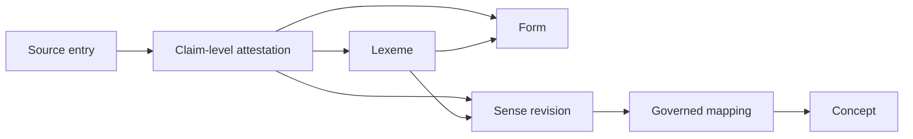

# Tafsiri Canonical Lexical Core Architecture 001

**Status:** Approved architecture proposal for SQL design review  
**Database effect:** None  
**Migration 011:** Not created

## 1. Executive summary

The canonical lexical core must distinguish **Lexeme → Form → Sense → Concept**. A source dictionary row is evidence after governed import; it is never automatically any of those canonical objects.

The minimum foundation should create stable lexical identities, governed forms, immutable sense meaning revisions, optional concept mappings, dialect scope, and claim-level source attestations. Candidate generation and full promotion workflow should follow in a later migration before any lexical data is admitted. Migration 011 should be additive, empty, deny-by-default, and make no changes to legacy tables.

## 2. Lexeme definition

A **lexeme** is a stable lexical identity within one language and an explicitly governed dialect scope. It groups forms and senses judged to belong to the same lexical unit. It is independent of any spelling, source row, English gloss, or concept.

Required identity fields are an opaque `lexeme_key`, `language_id`, lifecycle state, provenance origin, and creation authority. A lexeme may have a current canonical lemma form, but that circular reference must be deferrable and cannot define identity. Spelling, part of speech, and gloss must not be used to generate the key.

Recommended lifecycle: `PROVISIONAL`, `ACTIVE`, `DISPUTED`, `DEPRECATED`, `SUPERSEDED`. Verification of the identity itself is separately `UNVERIFIED`, `IN_REVIEW`, `VERIFIED`, `REJECTED`, or `DISPUTED`.

## 3. Form definition

A **form** is a governed written or linguistic representation belonging to one lexeme. Forms include lemmas, orthographic variants, historical spellings, inflected or derived forms, borrowed forms, tone-marked representations, and alternate transcriptions.

`lexeme_forms` should contain an opaque `form_key`, `lexeme_id`, representation text, representation system, form role, optional canonical dialect narrowing, verification state, provenance origin, and lifecycle dates. Exact source transcription remains in `source_entries` and claim-level attestations; a governed form never overwrites it.

Suggested roles: `LEMMA`, `ORTHOGRAPHIC_VARIANT`, `HISTORICAL`, `INFLECTED`, `DERIVED`, `BORROWED`, `TONE_MARKED`, `ALTERNATE_TRANSCRIPTION`, `OTHER`.

## 4. Sense definition

A **sense** is a stable identity for one meaning or use of a lexeme. Polysemy creates several senses under one lexeme; it does not create several lexemes merely because definitions differ.

Meaning-bearing content belongs in immutable `lexical_sense_revisions`: definition, lexical category, register, domain, grammatical restrictions, cultural context, usage notes, and revision reason. `lexical_senses` keeps the stable `sense_key`, parent lexeme, lifecycle, and deferrable current revision pointer.

Examples remain evidence or separately governed usage records. They should not be embedded as an unstructured list that cannot retain provenance.

## 5. Concept definition

A **concept** is a language-independent semantic identity. It is not an English gloss and not a collection of similar strings. A sense may have one verified concept mapping, no mapping, disputed mapping, or several candidates under review.

The existing `concepts` table should be reused and extended rather than dropped. Its `concept_key` is already a suitable stable identity. Meaning text should move prospectively into immutable concept revisions; the current `definition_en`, domain, subdomain, and notes remain compatibility fields until a governed migration is designed.

## 6. Entity relationships

- One lexeme has many forms.
- One lexeme has many senses.
- A form belongs to one lexeme; shared spelling is represented by separate form rows for separate lexemes.
- A sense maps to concepts only through governed `sense_concepts` rows.
- A source entry supports one or more independent attestations.
- Typed lexeme and form relationships are separate from identity.
- Expressions, idioms, and proverbs remain outside single-word lexical identity.

## 7. Dialect model

Dialect scope is explicit at three levels:

1. `lexeme_dialects` records the varieties in which the lexical identity is accepted, with roles such as `PRIMARY`, `ATTESTED_IN`, `SHARED`, or `CONTRASTS_WITH`.
2. A form may carry `dialect_id` when its realization is narrower than the lexeme.
3. `sense_dialects` records meaning or usage restricted to particular varieties.

Every lexeme has a required language. A dialect-general identity requires positive review; it cannot arise from merging similar strings. Cognates in different dialects default to distinct lexemes linked by an evidence-backed relationship.

Unresolved labels remain in `source_entries.raw_dialect_label` and attestations. They acquire a canonical dialect only through the existing `source_dialect_mapping_assertions` workflow. Adding that mapping later must not rewrite source evidence.

## 8. Homograph handling

Identical writing does not imply lexical identity. Unrelated homographs receive distinct lexeme IDs and distinct form rows, even if their form text, dialect, and representation system match. Search may return both. Uniqueness must therefore be by stable key and parent lexeme, not globally by string.

## 9. Polysemy handling

Related meanings share a lexeme and use distinct sense identities. Reviewers decide whether evidence supports polysemy or homography. That analytical decision is itself reviewable, evidence-backed, and disputable; string similarity or shared translation cannot decide it.

## 10. Source-attestation model

`lexical_attestations` links one `source_entry` to one claim target: lexeme identity, form, sense revision, concept mapping, lexical relationship, or form relationship. Exactly one target foreign key must be non-null.

Each row records claim type, evidence role (`SUPPORTS`, `CONTRADICTS`, `QUALIFIES`, `EXCEPTION`, `HISTORICAL_SUPPORT`), exact quoted or structured value where needed, verification state, reviewer fields, and notes. One dictionary row can therefore support a form while leaving its POS in review and contradicting another source's sense analysis.

## 11. Provenance model

Provenance and verification remain orthogonal. `provenance_origin` uses `MACHINE_GENERATED`, `IMPORTED`, or `HUMAN`; review never erases it. Source-derived claims also retain `source_entry_id`, whose existing chain reaches import batch, exact artifact, source version, and source.

Canonical entities record who or what promotion created them, while attestations preserve where each claim came from. Canonical tables do not duplicate source title, artifact checksum, or locator fields.

## 12. Normalization model

Exact source forms stay unchanged in `source_entries.original_form`. `form_normalizations` records one or more proposed or accepted normalized representations with normalization policy/version, method, rationale, provenance origin, reviewer, review time, and verification status. A normalization may later resolve to a governed form.

Changing normalization logic creates another row and policy version. It never updates the source string or silently rewrites an earlier normalization.

## 13. Form relationships

`form_relationships` links two form identities with a controlled type: `ORTHOGRAPHIC_VARIANT`, `PHONOLOGICAL_VARIANT`, `MORPHOLOGICAL_VARIANT`, `HISTORICAL_VARIANT`, `BORROWED_FORM`, `INFLECTED_FORM`, `DERIVED_FORM`, or `ALTERNATE_TRANSCRIPTION`.

Each relationship has directionality, verification state, provenance, and attestations. String similarity may generate a candidate only; it cannot create a verified relationship.

## 14. Lexical category strategy

Part of speech belongs primarily to the sense revision because meaning and grammatical behavior can differ across uses. A lexeme may have an optional reviewed broad category only when all current senses support it. Related noun/verb or adjective/verb derivations should normally be distinct lexemes connected by `DERIVED_FROM`; genuinely polyfunctional uses may remain one lexeme with sense-level categories after review.

## 15. Morphology boundary

Migration 011 should allow future morphology without encoding a runtime engine. Forms may store optional reviewed noun/agreement class, root or stem notes, and opaque structured morphology with a schema version only if needed. Productive decomposition, paradigms, agreement generation, and G2P rules are deferred to dedicated governed structures.

## 16. Pronunciation boundary

Forms may link to existing `linguistic_evidence` through a small evidence association using roles such as `PRONUNCIATION`, `TONE`, or `SYLLABIFICATION`. IPA phonemic, IPA phonetic, orthographic notes, tone, and syllabification should reuse the existing notation framework. Migration 011 should not duplicate pronunciation evidence as free text on every form.

## 17. Register model

Register is primarily sense-level and uses `GENERAL`, `RELIGIOUS`, `HISTORICAL`, `TECHNICAL`, `COLLOQUIAL`, `FORMAL`, `CULTURAL`, or `OTHER`. An attestation can record the source's register claim independently. Form-level register is allowed only for a representation-specific restriction. Bible attestations remain religious evidence and cannot silently become general usage.

## 18. Borrowing model

Established borrowings are valid lexical data. A borrowed lexeme/form records source language when known and uses evidence-backed `BORROWED_FROM` or `BORROWED_FORM` relationships. Unknown etymology stays unknown. Borrowing status does not reduce verification requirements or justify inventing a replacement.

## 19. No-equivalent handling

`NO_ESTABLISHED_EQUIVALENT`, `PRESERVE_AND_EXPLAIN`, and `UNCERTAIN` describe a reviewed gap or response policy, not a lexeme. A later `lexical_gap_assertions` table should relate a concept or requested meaning to language/dialect scope, explanation, evidence, and review state. Until then, the existing empty `concept_terms` model demonstrates the needed null-term behavior but should not be used to fabricate core lexemes.

## 20. Verification states

Use the common uppercase vocabulary `UNVERIFIED`, `IN_REVIEW`, `VERIFIED`, `REJECTED`, `DISPUTED` independently on lexeme identity, form validity, sense revisions, concept mappings, normalizations, and relationships. Lifecycle state and verification state are different dimensions. Verified rows require reviewer and timestamp; rejected/disputed rows remain auditable.

## 21. Human review units

Review units are deliberately separable: lexical identity, dialect scope, form validity, normalization, sense interpretation, lexical category, concept mapping, and relationship type. A reviewer may accept the exact form while disputing its meaning. Reviewer expertise and authority must be checked for the dialect/domain involved. The Reviewer Portal gets no access until a dedicated lexical workflow is designed.

## 22. Contradictory evidence

Contradictions remain as attestations with `CONTRADICTS` or `QUALIFIES`. Conflicts in spelling, meaning, POS, dialect, pronunciation, or etymology do not update or delete earlier evidence. Resolution requires an explicit reviewed revision or promotion, with the dissenting evidence still linked.

## 23. Appleby/Wanga/Bukusu walkthrough

1. Import an Appleby 1943 row as a source entry with its exact historical spelling and raw variety label.
2. Create separate attestations for form, gloss, POS, and dialect claim.
3. Modern Wanga and Bukusu review may propose distinct forms and senses under distinct dialect-scoped lexemes.
4. Reviewers may link them as `COGNATE_WITH`, `HISTORICAL_VARIANT`, or leave them unrelated.
5. Retranslation into modern varieties is a reviewed interpretation, not proof that all spellings are one lexeme or concept.

## 24. Luyia workbook walkthrough

Each workbook row and cell becomes source evidence. Column alignment is recorded as `SOURCE_PROVIDED_CORRESPONDENCE`. It does not establish `SAME_LEXEME`, `SAME_SENSE`, or `SAME_CONCEPT`. Stronger links require dialect resolution, independent form/sense review, supporting attestations, and explicit relationship approval.

## 25. Idakho unresolved example

`Idakho_1` and `Idakho_2` remain raw source labels on entries and attestations. Both columns can be imported and compared without canonical dialect IDs. No merge, split, register interpretation, or speaker-group meaning is asserted until evidence and human review establish it.

## 26. Tura/Lutura unresolved example

An entry labeled `Lutura` retains that exact label. A lexical candidate can cite it without a canonical dialect. A later verified mapping assertion may attach a dialect to downstream candidates or attestations; it must not rewrite the original entry.

## 27. Legacy-data boundary

`dictionary_entries`, `luhya_dict`, `luhya_dictionary`, `translations`, knowledge tables, and proverb tables are legacy or application data, not canonical lexical objects. They require later source reconciliation, artifact registration where possible, import batches, source entries, candidates, and review. Migration 011 performs no backfill and changes none of these tables.

## 28. Candidate-generation boundary

The path is `source_entry → lexical candidate → human review → canonical objects`. Candidate tables should be introduced in a subsequent migration because candidate deduplication, assignments, and review UX are workflow concerns rather than canonical identity. Migration 011 may define only the target foundation and status vocabularies.

## 29. Canonical-promotion model

Use a dedicated lexical promotion layer inspired by rule governance, not copied mechanically. One proposal may atomically create or revise a lexeme, forms, senses, mappings, relationships, and evidence links. Promotions require stable keys, evidence-set checksum, policy version, requested/approved authority, idempotency key, and explicit outputs. Imports never call promotion automatically.

## 30. Revision strategy

- Lexeme identities are stable; lifecycle transitions are audited, not text revisions.
- Form text is immutable after verification. Corrections create a replacement form and relationship.
- Sense meaning is revisioned because accepted definitions, POS, restrictions, and context can change.
- Concept meaning is revisioned prospectively.
- Mappings and relationships are append-only governed assertions that can be rejected, disputed, superseded, or retired.

This avoids revision tables for every row while preventing silent semantic rewrites.

## 31. Stable identity strategy

`lexeme_key`, `form_key`, `sense_key`, and `concept_key` are opaque, immutable, unique identifiers assigned by a deterministic proposal or trusted promotion. They do not contain mutable lemma, gloss, dialect name, or POS. UUID primary keys support joins; public keys support portability and idempotency.

## 32. Existing concept-table compatibility

Decision: **REUSE AND EXTEND `concepts`; SUPERSEDE `concept_terms` FOR NEW CANONICAL WRITES WITHOUT DROPPING IT.**

`concepts` already supplies stable keys and currently has no production rows. Migration 011 may add lifecycle/current-revision metadata and a `concept_revisions` table while preserving all existing columns. `concept_terms` conflates form, explanation, provenance, verification, source row, and concept mapping; it should remain a compatibility surface until a separate migration and data audit determine its future. No rewrite occurs in Migration 011.

## 33. Embedding and retrieval boundary

Embeddings are derived projections, not identity. Keep them out of lexeme, form, sense, and concept truth tables. A later versioned retrieval index can record model, dimensions, input checksum, object revision, and build. Existing PostgreSQL and pgvector are sufficient until measurements show otherwise.

## 34. Training-data boundary

The future path is `canonical lexical knowledge → immutable dataset build → rights/use-policy filtering → evaluation → explicit training authorization`. Canonical status alone does not authorize training. Dataset manifests must retain source/artifact lineage and exclude records whose policies do not allow the intended use.

## 35. Serving boundary

The canonical core is not a public API. Future lookup, translation, search, RAG, or mobile projections may denormalize accepted data with a build version and source checksums. Serving projections never become the authority and cannot update canonical records.

## 36. Security model

New canonical tables start with RLS enabled, no policies, privileges revoked from `anon` and `authenticated`, and service-role/trusted administrative access only. No public RPC, security-definer mutation function, or Reviewer Portal access belongs in Migration 011. Workflow access requires separate threat modeling and migration review.

## 37. Scaling assessment

The relational design is suitable for 10,000 and 100,000 lexical objects without special partitioning. At one million objects, indexed foreign-key and normalized-form lookup remains practical in PostgreSQL; attestations and review history may require partitioning or archival based on measured query plans. Correctness constraints and selective indexes come first. Embeddings and full-text search remain derived workloads.

## 38. Proposed tables

| Table | Purpose | Migration 011? |
|---|---|---|
| `lexemes` | Stable language-level lexical identities | Yes |
| `lexeme_dialects` | Governed lexeme dialect scope | Yes |
| `lexeme_forms` | Governed forms and representation roles | Yes |
| `form_normalizations` | Versioned normalization assertions | Yes |
| `lexical_senses` | Stable sense identities | Yes |
| `lexical_sense_revisions` | Immutable meaning revisions | Yes |
| `sense_dialects` | Sense-specific dialect scope | Yes |
| `sense_concepts` | Governed candidate/verified concept mappings | Yes |
| `lexical_attestations` | Claim-level links to source entries | Yes |
| `lexical_linguistic_evidence` | Reviewed pronunciation, tone, morphology, or other evidence links | Yes |
| `lexical_relationships` | Lexeme/sense semantic or historical relations | Yes, minimal types |
| `form_relationships` | Evidence-backed relationships between forms | Yes |
| `concept_revisions` | Prospective immutable concept meaning | Yes |
| `lexical_candidates` and review assignments | Import proposal workflow | Later |
| `lexical_promotions` and outputs | Atomic canonicalization workflow | Later, before data |
| `lexical_gap_assertions` | No-equivalent and preserve/explain decisions | Later |
| morphology paradigms / runtime rules | Productive morphology | Later |
| expression, idiom, and proverb core | Multiword cultural knowledge | Separate architecture |

## 39. Key constraints

- All public keys are nonblank and unique.
- Foreign keys use `ON DELETE RESTRICT`.
- Current revision pointers use composite `(revision_id, parent_id)` deferrable foreign keys.
- Verified rows require reviewer and review timestamp.
- Source attestations require exactly one target and one source entry.
- A current verified sense may have at most one `VERIFIED` concept mapping; candidate/disputed mappings may coexist.
- Form text, representation system, and parent lexeme become immutable after verification.
- Normalization requires policy version, method, and source form/entry.
- Relationship self-links are prohibited; symmetric relationship types use canonical endpoint ordering.
- Canonical dialect IDs are never required for unresolved raw labels.
- No cascade delete can erase reviewed evidence or canonical history.

## 40. Required indexes

- Unique indexes on every stable key.
- `lexemes(language_id, lifecycle_status)` and `lexeme_dialects(dialect_id, role)`.
- `lexeme_forms(lexeme_id)`, `(dialect_id, representation_system)`, and a non-unique normalized-search expression.
- `lexical_senses(lexeme_id, lifecycle_status)` and revisions by `(sense_id, revision_number)`.
- `sense_dialects(dialect_id)` and `sense_concepts(concept_id, mapping_status)`.
- `lexical_attestations(source_entry_id)`, each non-null target FK, and `(verification_status, claim_type)`.
- Relationship indexes on both endpoints and relationship type.
- Normalizations by source entry/form and normalization version.

No global unique constraint on spelling is permitted.

## 41. Architecture decision records

1. **ADR-CLC-001:** Source entries are evidence, not lexical truth.
2. **ADR-CLC-002:** Lexeme, form, sense, and concept are distinct identities.
3. **ADR-CLC-003:** Lexical identity is dialect-first and never created by cross-dialect string merging.
4. **ADR-CLC-004:** Exact source forms are immutable and remain in source evidence.
5. **ADR-CLC-005:** Normalization is versioned, attributable, and reviewable.
6. **ADR-CLC-006:** Homographs remain separate lexical identities.
7. **ADR-CLC-007:** Polysemy uses multiple senses under one reviewed lexeme.
8. **ADR-CLC-008:** Concept mapping is optional, relational, governed, and may remain disputed.
9. **ADR-CLC-009:** Canonical lexical knowledge is not a training dataset or training authorization.
10. **ADR-CLC-010:** Unresolved dialect labels remain source evidence until separately mapped.
11. **ADR-CLC-011:** Canonicalization requires explicit human action and an atomic promotion workflow.
12. **ADR-CLC-012:** Concepts are reused and extended; `concept_terms` is retained only for compatibility pending audit.
13. **ADR-CLC-013:** Embeddings and serving projections remain derived from canonical truth.
14. **ADR-CLC-014:** Proverbs and idioms require separate expression architecture.

## 42. Migration 011 scope

Migration 011 — Canonical Lexical Core Foundation should:

- add the twelve core lexical tables and `concept_revisions` listed above;
- extend `concepts` additively for lifecycle and current revision linkage;
- define controlled checks, composite constraints, indexes, comments, and immutability guards;
- enable RLS and deny client access;
- insert no lexical data;
- perform no legacy backfill;
- add no candidate, portal, serving, embedding, dataset, or runtime workflow;
- leave all existing tables and data intact.

Before SQL is accepted, a table-by-table design review should reduce any field duplication and prove every circular reference can be created safely with deferrable constraints.

## 43. Deferred structures

Deferred work includes candidate generation and deduplication, review assignments, lexical promotions, gap assertions, expression/idiom/proverb modeling, morphology paradigms, pronunciation projections, etymology depth, concept ontology relations, embeddings, dataset builds, serving views, and public APIs.

## 44. Open questions

1. Should a lexeme spanning reviewed dialects be one identity with several scopes, or should the default always be one identity per canonical dialect with cross-dialect cognate links?
2. Which lexical category vocabulary best represents Bantu-specific categories without forcing English POS labels?
3. Should verified concept mapping permit more than one concept for compositional or culturally specific senses?
4. Which symmetric relationship types need database endpoint ordering?
5. Should form normalization target a governed form immediately or remain text-only until promotion?
6. Which existing contributor authority roles can approve lexical identity, sense meaning, and concept mapping?
7. Should concept revisions become part of Migration 011 or a concept-governance follow-up after the first lexical pilot?
8. What minimum structured morphology belongs on a form without anticipating a runtime engine?
9. How should expressions share lexical components without treating a proverb as a lexeme?
10. What pilot sample best tests homography, polysemy, borrowing, dialect divergence, and unresolved labels before importing at scale?

## 45. Recommended next task

Conduct **Migration 011 SQL Design 001**: convert this architecture into an additive, empty migration proposal with exact columns, checks, foreign keys, indexes, RLS posture, comments, and rollback-only local tests. Use a small synthetic schema fixture plus Appleby/Wanga/Bukusu, Luyia workbook, Idakho, and Lutura test cases; do not import production data.

**Final recommendation: READY TO DESIGN MIGRATION 011 SQL**

Staging writes: **ZERO**. Production writes: **ZERO**.
