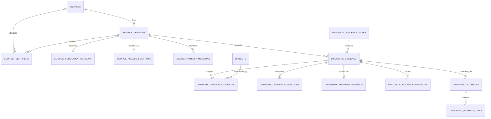

# Tafsiri Linguistic Evidence Architecture 001

## Status and decision

Architecture status: **approved for Migration 007 SQL design**. This document changes no database schema and performs no production writes.

The staging branch contains Literature Inventory 001 at commit `472d817e3d7eede892681ebdb573bddda7d5938b`. Migration 006 remains the provenance foundation. Migration 007 should extend it rather than create a parallel publication registry.

## 1. Executive summary

Tafsiri needs an evidence layer between scholarly publications and canonical linguistic behavior. A publication is a source work; a source version is the citable edition or artifact; a linguistic-evidence row is one concise Tafsiri interpretation of a located scholarly observation. Human review may verify that interpretation. A later promotion process may use several verified evidence rows to propose a versioned canonical linguistic rule.

```text
PUBLICATION → SOURCE VERSION → LINGUISTIC EVIDENCE → HUMAN REVIEW
            → FUTURE CANONICAL LINGUISTIC RULE
```

Evidence never becomes canonical merely because it was extracted, machine generated, peer reviewed, or marked verified. Dictionary entries, lexical data, concepts, translations, reviewer annotations, model output, RAG chunks, scholarly evidence, and future canonical rules remain separate entities.

## 2. Source model extensions

Retain `sources` as the work-level identity and `source_versions` as the edition, release, manuscript, repository artifact, or publisher version. The 46 inventory records map into these tables, with one `sources` row per deduplicated work and at least one `source_versions` row per registered citable version.

Migration 007 should add these `sources.source_type` values without removing existing values:

- `ACADEMIC_PAPER`: scholarly paper whose publication class is not established; fallback only
- `JOURNAL_ARTICLE`: article published in a journal
- `BOOK_CHAPTER`: chapter in an edited or authored book
- `THESIS`: degree thesis whose level is unknown or outside the masters/doctoral distinction
- `DISSERTATION`: doctoral dissertation
- `GRAMMAR`: book-length or standalone grammatical description
- `CONFERENCE_PAPER`: proceedings paper, published conference contribution, or stable conference paper
- `TECHNICAL_REPORT`: institutional or project report

`JOURNAL_ARTICLE` should remain separate from `ACADEMIC_PAPER`. The latter is a governed fallback, not an umbrella value applied alongside a specific type. Literature Registry `MASTERS_THESIS` maps to `THESIS`; `DOCTORAL_DISSERTATION` maps to `DISSERTATION`. Existing source types and seven registered source rows remain valid.

## 3. Scholarly metadata, authority, and availability

Add `source_scholarly_metadata`, keyed one-to-one to `source_version_id`, for publication-specific metadata:

- authority type
- peer-review status where explicitly known
- publication/venue title
- volume, issue, page range
- publisher or awarding institution override
- bibliographic notes
- metadata verification status and review provenance

Authority belongs to the source version because a dissertation, preprint, proceedings paper, and later journal article can represent versions of related work with different authority. Work-level title and authors remain on `sources`; version-specific citation stays on `source_versions`.

Authority, availability, rights, verification, and usefulness are independent dimensions. Availability belongs to each access location. Rights stay in `source_rights`; allowed uses stay in `source_use_policies`.

## 4. Identifier model

Add `source_identifiers` with exactly one owner:

| Field | Purpose |
|---|---|
| `id` | UUID identity |
| `source_id` | Work-level owner when the identifier denotes the publication as a work |
| `source_version_id` | Version-level owner when the identifier denotes a particular edition/artifact |
| `identifier_type` | Governed type |
| `identifier_value` | Preserved identifier value |
| `normalized_value` | Deterministic deduplication form |
| `canonical_url` | Resolved identifier URL when known |
| `is_primary` | Preferred identifier within its type and owner |
| `verification_status` | `UNVERIFIED`, `IN_REVIEW`, `VERIFIED`, `REJECTED`, `DISPUTED` |
| review/timestamps | Audit trail |

Initial identifier types: `DOI`, `ISBN`, `ISSN`, `HANDLE`, `ARK`, `OCLC`, `INSTITUTIONAL_REPOSITORY_ID`, `ZENODO_DOI`, and `DATAVERSE_DOI`. A row must reference exactly one of `source_id` or `source_version_id`. Uniqueness applies to `(identifier_type, normalized_value)`, subject to an explicit exception workflow for genuinely shared identifiers. DOI normalization removes resolver prefixes and case differences without altering the displayed value.

## 5. Access-location model

Add `source_access_locations`, owned by `source_version_id`:

- URL and normalized URL
- location type
- host/domain
- authority rank or `is_primary`
- availability
- downloadable flag
- first/last verified access time
- artifact filename, byte size, checksum, checksum algorithm, and page count when known
- notes and verification provenance

Location types: `PUBLISHER`, `INSTITUTIONAL_REPOSITORY`, `AUTHOR_SITE`, `DATA_REPOSITORY`, `ACADEMIA`, `RESEARCHGATE`, `OTHER`.

Availability values: `OPEN_FULL_TEXT`, `PUBLIC_FULL_TEXT_UNCLEAR_LICENSE`, `ABSTRACT_ONLY`, `PAYWALLED`, `METADATA_ONLY`, `UNAVAILABLE`.

One version may have many access locations. A partial unique index should allow only one current primary location per version. Host type and access do not grant rights. Artifact checksum fields describe a retrieved file and must use the same checksum-pair rule as Migration 006.

## 6. Source variety model

Add `source_variety_mentions`, owned by `source_version_id`:

- literal variety name exactly as printed by the source
- normalized search label, without replacing the literal label
- optional candidate `dialect_id`
- mention scope: `SOURCE_WIDE`, `SECTION`, `CLAIM`, `EXAMPLE`, `DATASET`
- locator
- mapping status
- rationale and review audit fields

Candidate dialect mapping uses `UNVERIFIED`, `IN_REVIEW`, `VERIFIED`, `REJECTED`, or `DISPUTED`. Verification requires reviewer, time, rationale, and authority. This table is a literature-specific mention structure; it does not replace Migration 006 source-entry mapping assertions. It preserves labels such as `Bukusu`, `Lubukusu`, `Wanga`, `Luwanga`, `Logooli`, `Llogoori`, `Maragoli`, `Nyala`, `Samia`, and `Lusaamia`.

## 7. Comparative and family scope

`linguistic_evidence.evidence_scope` uses:

- `DIALECT`
- `MULTI_DIALECT_COMPARATIVE`
- `PROTO_LANGUAGE`
- `FAMILY_GENERALIZATION`

Living dialect participation is represented only through `linguistic_evidence_dialects`. Proto-Luyia is not inserted as a modern dialect. Proto and family rows use a required `scope_label` and may optionally reference the existing `languages` row for the family/macrolanguage once that identity has been reviewed. `PROTO_LANGUAGE` and `FAMILY_GENERALIZATION` must not require a `dialect_id`.

A comparative publication may mention six varieties while one evidence assertion concerns only two. Evidence-to-dialect links therefore attach at the claim level and do not inherit every source-level mention.

## 8. Core linguistic evidence model

Add `linguistic_evidence` for one atomic Tafsiri interpretation of one located scholarly claim or observation:

| Field group | Fields |
|---|---|
| Identity/provenance | `id`, `source_version_id`, `evidence_type_id` |
| Scope | `evidence_scope`, `scope_label` |
| Locator | `page_start`, `page_end`, `section_label`, `figure_label`, `table_label`, `footnote_label`, `source_locator` |
| Interpretation | `summary`, `conditions_summary`, `exceptions_summary` |
| Assessment | `verification_status`, `certainty` |
| Origin | `provenance_type`, `extraction_method`, `extraction_tool`, `extraction_tool_version`, `extractor_config_hash` |
| Audit | `extracted_by`, `extracted_at`, `reviewed_by`, `reviewed_at`, `created_at`, `updated_at` |
| History | `superseded_at`, `superseded_by` |

At least one precise locator is required. `summary` is a concise Tafsiri interpretation and must not default to copied publication text. Evidence is append-oriented; corrections create a superseding row.

Use certainty values `HIGH`, `MEDIUM`, `LOW`, and `UNCERTAIN`. Certainty describes the extractor/reviewer's confidence that the evidence row represents the located source claim. It does not measure whether the published analysis is universally correct.

## 9. Evidence taxonomy

Use a governed lookup table, `linguistic_evidence_types`, rather than a large CHECK constraint or uncontrolled text. Fields should include `type_key`, label, description, parent type, schema version, active status, creation time, and deprecation/supersession metadata.

First implementation types:

- `PHONEME_INVENTORY`
- `GRAPHEME_PHONEME_RULE`
- `ALLOPHONIC_RULE`
- `TONE_RULE`
- `TONE_PATTERN`
- `SYLLABLE_RULE`
- `VOWEL_LENGTH_RULE`
- `PHONOLOGICAL_PROCESS`
- `MORPHOPHONOLOGICAL_RULE`
- `NOUN_CLASS_RULE`
- `AGREEMENT_RULE`
- `INFLECTION_RULE`
- `DERIVATION_RULE`
- `VERB_TEMPLATE`
- `TENSE_ASPECT_RULE`
- `NEGATION_RULE`
- `SYNTACTIC_RULE`
- `ARGUMENT_STRUCTURE_RULE`
- `MODALITY_RULE`
- `IDEOPHONE_ASSERTION`
- `LOANWORD_ADAPTATION_RULE`
- `TERMINOLOGY_ASSERTION`
- `DIALECT_VARIATION_ASSERTION`
- `ACOUSTIC_OBSERVATION`

Examples, paradigms, and minimal pairs are modeled as evidence-linked examples rather than claim types. Defer specialized stress, evidentiality, augmentative, diminutive, lexical-category, word-order, and object-marking subtypes until Extraction 001 demonstrates that separate governed types improve validation. They can initially use the closest parent type without losing source wording in the summary.

## 10. Dialect linkage

Add `linguistic_evidence_dialects`:

- `evidence_id`
- `dialect_id`
- optional `source_variety_mention_id`
- role: `PRIMARY`, `COMPARISON`, `CONTRAST`, `EXCEPTION`
- notes

The primary key is `(evidence_id, dialect_id, role)`. A `DIALECT` evidence row requires exactly one `PRIMARY` link. `MULTI_DIALECT_COMPARATIVE` requires at least two dialect links, enforced with a deferred constraint trigger because a simple CHECK cannot count related rows. Proto/family evidence permits zero dialect links. Links must never be created solely from the publication's overall coverage list.

## 11. Structured phonological notation

Add `linguistic_evidence_notations` because a single claim may require orthographic, phonemic, phonetic, tone, and feature representations:

- evidence owner
- notation type
- notation role
- exact Unicode representation
- environment or position note
- sequence order

Notation types: `IPA_PHONEMIC`, `IPA_PHONETIC`, `ORTHOGRAPHIC`, `H_L_TONE`, `AUTOSEGMENTAL`, `FEATURE_DESCRIPTION`, `OTHER`. Roles begin with `INPUT`, `OUTPUT`, `UNDERLYING`, `SURFACE`, `CONTEXT`, and `EXCEPTION`. Original Unicode is immutable; any search normalization is derived separately.

## 12. G2P evidence

Add a narrow typed child table, `grapheme_phoneme_evidence`, for `GRAPHEME_PHONEME_RULE` and `ALLOPHONIC_RULE` rows:

- `evidence_id`
- `grapheme`
- optional phonemic target
- optional phonetic target/allophone
- environment
- boundary context
- exceptions summary

At least one target is required. The child row is evidence, not executable G2P logic. It cannot be queried as a canonical pronunciation rule without later promotion. Structured columns are preferable to generic JSON because grapheme, target, and environment will be validated and compared frequently.

## 13. Tone evidence

Migration 007 should represent tone through evidence type, notation rows, concise conditions, examples, and dialect links. `H_L_TONE` and `AUTOSEGMENTAL` notation preserve H, L, downstep, floating tones, melodies, and diagrams without pretending to encode a full autosegmental grammar.

Do not add a universal tone-rule execution table in Migration 007. After the first extraction, a typed tone child may model tone-bearing units, operations such as spreading/deletion/shift/retraction, direction, target, trigger, and morphological context. Exact published notation remains recoverable independently of that later abstraction.

## 14. Morphological evidence

Migration 007 stores governed evidence types, concise structured notations, examples, and conditions. It should not attempt a complete morphological parser schema.

Future typed children may represent noun-class markers, concord targets, verb-template slots, TAM features, polarity, derivational extensions, reduplication, and inflection. `NOUN_CLASS_RULE`, `AGREEMENT_RULE`, `VERB_TEMPLATE`, `TENSE_ASPECT_RULE`, and related evidence types give Extraction 001 stable destinations while the actual recurring structures are measured.

## 15. Syntax, semantics, and pragmatics

Syntax and semantic evidence use atomic rows scoped to the stated source claim. Argument structure, modality, ideophone intensification, and dialect variation have initial governed types. General syntactic or semantic observations use `SYNTACTIC_RULE` or a future approved child of the taxonomy.

Do not encode publication-wide theoretical frameworks as rules applying to every cited example. Competing analyses remain separate evidence rows.

## 16. Examples and interlinear glosses

Add `linguistic_examples`:

- optional `evidence_id`
- required `source_version_id` and locator
- example type: `LEXICAL_FORM`, `PHRASE`, `SENTENCE`, `MINIMAL_PAIR`, `PARADIGM`, `ACOUSTIC_TOKEN`
- concise description
- dialect link where reviewed
- rights/display status
- sequence and audit fields

Add `linguistic_example_tiers` rather than a fixed four-line blob:

- `example_id`
- `tier_type`: `SOURCE_TEXT`, `ORTHOGRAPHIC`, `SEGMENTATION`, `MORPHEME_GLOSS`, `FREE_TRANSLATION`, `PHONEMIC`, `PHONETIC`, `TONE`, `OTHER`
- `tier_text`
- language tag where known
- sequence

This supports variable interlinear layouts while keeping tiers queryable. `display_status` begins with `RESEARCH_ONLY`, `REVIEW_ALLOWED`, `PUBLIC_ALLOWED`, and `UNKNOWN`; it can only further restrict the effective `source_use_policies` decision and can never expand it.

## 17. Acoustic evidence

Defer a full laboratory schema. A minimal future `linguistic_acoustic_measurements` child can hold evidence/example owner, measurement type, numeric value, unit, condition, aggregation type, sample/population note, and table/figure locator. Migration 007 need only reserve `ACOUSTIC_OBSERVATION` and `ACOUSTIC_TOKEN`; add the numeric child when the Lusaamia extraction requirements are reviewed.

## 18. Conflicting evidence

Add `linguistic_evidence_relations` with controlled relations `SUPPORTS`, `CONTRADICTS`, `REFINES`, and `ALTERNATIVE_TO`. Relations connect evidence rows without deleting, merging, or lowering the status of either publication's claim. A relation records its assessor and rationale. Symmetric relation types should use deterministic ordering to prevent duplicates.

`DISPUTED` means Tafsiri's review found a material unresolved issue. It must not erase the evidence row. Two verified rows may still be related as alternative analyses when both accurately represent their sources.

## 19. Verification and provenance

Reuse `UNVERIFIED`, `IN_REVIEW`, `VERIFIED`, `REJECTED`, and `DISPUTED`. Do not add a redundant extraction lifecycle: a row's existence plus `extracted_at` means it was extracted; verification status describes review state.

`VERIFIED` requires reviewer, review time, and nonblank review rationale. `REJECTED` and `DISPUTED` also require review provenance. Review fields must be both null or both present.

Provenance values are `HUMAN`, `MACHINE_GENERATED`, and `IMPORTED`. Origin is immutable. An LLM-assisted row remains `MACHINE_GENERATED` after a linguist verifies it.

Extraction methods are `HUMAN_MANUAL`, `LLM_ASSISTED`, and `DETERMINISTIC_PARSER`. Machine methods require tool/model name and version; reproducible configured runs should also record a configuration or prompt-template hash. Never store hidden reasoning or chain-of-thought.

## 20. Canonical-rule boundary

Do not create `linguistic_rules` in Migration 007. Migration 009 should introduce versioned canonical rules, promotion records, approval authority, dialect scope, exceptions, and many-to-many supporting evidence.

No trigger or job may promote evidence automatically. Verification confirms the accuracy of the extraction against its source; promotion decides whether Tafsiri adopts a rule. A canonical rule should require human linguistic validation and one or more supporting evidence records, while allowing recorded conflicting evidence.

## 21. Relation to lexical core and terminology

Migration 008 will create lexemes, lexical forms, lexical senses, and sense-concept assertions. Later link tables may connect evidence to lexical forms, POS/category assertions, pronunciations, morphological relationships, borrowings, or sense behavior. Migration 007 must not depend on tables that do not yet exist.

Terminology evidence records what a publication reports. It cannot set `VERIFIED_BORROWED`, `DESCRIPTIVE`, `TRANSLITERATED`, `PRESERVE_EXPLAIN`, or `NO_EQUIVALENT`. Those are future reviewed decisions supported by evidence.

## 22. Relation to RAG

RAG chunks are retrieval projections. A chunk may lead an extractor to a page, but it is not a linguistic-evidence assertion. Evidence must cite a source version and locator, carry provenance and review status, and survive reindexing. RAG identifiers may be stored as extraction-run diagnostics, never as the authoritative source identity.

## 23. Rights and display

Metadata and concise Tafsiri interpretations may exist for restricted sources. Full passages are not stored by default. Examples and exact notation require source-specific policy review, particularly for reviewer or public display.

Effective access is the most restrictive combination of RLS, the current `source_use_policies` decision, and the example's display status. `PUBLIC_FULL_TEXT_UNCLEAR_LICENSE` remains an availability fact and grants no reuse permission.

## 24. Migration 007 minimum scope

Migration 007, **Linguistic Literature & Evidence Foundation**, should contain only:

1. Additive `sources.source_type` vocabulary expansion.
2. `source_scholarly_metadata`.
3. `source_identifiers`.
4. `source_access_locations`.
5. `source_variety_mentions`.
6. `linguistic_evidence_types` plus seed taxonomy.
7. `linguistic_evidence`.
8. `linguistic_evidence_dialects`.
9. `linguistic_evidence_notations`.
10. `grapheme_phoneme_evidence`.
11. `linguistic_evidence_relations`.
12. `linguistic_examples` and `linguistic_example_tiers`.
13. Indexes, audit triggers, comments, RLS enablement, revocations, and service-role grants.

Defer canonical rules, acoustic measurement schema, complete tone structures, complete morphology structures, lexical links, RAG tables, and all literature data registration.

## 25. Proposed table dependencies



## 26. Key constraints and future tests

Migration SQL and smoke tests should verify:

- all new source types are additive and the seven existing sources remain valid;
- exactly one identifier owner and normalized identifier uniqueness;
- one primary access location per source version;
- availability never changes rights or use policy;
- literal variety labels cannot be blank or overwritten by a canonical name;
- every evidence row references a valid source version and active evidence type;
- at least one source locator is present;
- scope and dialect-link counts are consistent;
- notation Unicode is preserved;
- G2P child type matches its parent evidence type;
- verification review requirements are enforced;
- provenance origin cannot be changed by later verification;
- conflicting verified evidence is allowed;
- supersession remains within the same logical source/evidence context;
- restricted examples are unavailable to `anon` and ordinary authenticated users;
- no database mechanism promotes evidence into canonical rules.

## 27. RLS and security intent

Follow Migration 006's deny-by-default posture:

- enable RLS on every new table;
- revoke all privileges from `anon` and `authenticated` initially;
- grant the service role required pipeline access;
- add no permissive public policy in Migration 007;
- authorize researcher read/review access later through explicit roles or server-side functions;
- give reviewer portal users no direct access until a concrete workflow requires it;
- serve future verified rules through separate controlled interfaces.

## 28. Conceptual examples

These are representation sketches, not extracted or verified claims:

| Case | Core representation |
|---|---|
| Lubukusu `kh` | `GRAPHEME_PHONEME_RULE`; orthographic and phonetic notation; Lubukusu primary link; Wasike source version and exact locator required |
| Lubukusu `b` | `ALLOPHONIC_RULE`; orthographic input, phonetic output, explicit environment; exact locator required |
| Lwisukha noun tone | `TONE_PATTERN`; H/L notation; Lwisukha primary link; noun context and locator |
| Tachoni verbal melody | `TONE_PATTERN`; autosegmental/H-L notation; tense/aspect context and locator |
| Lusaamia duration | `ACOUSTIC_OBSERVATION`; phonetic notation; future numeric measurement child and table/figure locator |
| Luwanga alternation | `MORPHOPHONOLOGICAL_RULE`; input/output notation and conditioning environment |
| Lubukusu adjective agreement | `AGREEMENT_RULE`; noun-class context, agreement markers, examples, locator |
| Ideophone comparison | `IDEOPHONE_ASSERTION`; comparative scope; Llogoori, Lunyore, and Lutiriki links with roles limited to the specific claim |
| Lwidakho borrowing | `LOANWORD_ADAPTATION_RULE`; donor/recipient forms, repair environment, examples, locator |
| Lubukusu medical gap | `TERMINOLOGY_ASSERTION`; summary of reported interpretability/strategy evidence, without making a canonical terminology decision |

## 29. First extraction batch

Use these 11 registry sources for **Tafsiri Linguistic Evidence Extraction 001**:

1. `MUTONYI_2000_BUKUSU_MORPHOPHONOLOGY`
2. `WASIKE_2017_ADJECTIVES_LUBUKUSU`
3. `NANDELENGA_2014_LUBUKUSU_SYLLABLE`
4. `MARLO_AKIDAH_1999_LUWANGA_MORPHOPHONEMICS`
5. `EBARB_GREEN_MARLO_LUYIA_TONE_MELODIES`
6. `NANDAMA_2022_LWISUKHA_TONE`
7. `OND0NDO_2013_KISA_WORD_STRUCTURE`
8. `SHIDIAVAI_2015_LWIDAKHO_LOANWORDS`
9. `MULAMA_2019_OLUMARAMA_PHONOLOGY`
10. `BOWLER_GLUCKMAN_2017_IDEOPHONES`
11. `GLUCKMAN_ETAL_2017_LUYIA_MODALITY`

This batch balances Lubukusu and Luwanga with comparative tone, southern/central varieties, phonology, morphology, semantics, ideophones, and terminology-relevant borrowing. Before extraction, each source must have a registered source/version, access-location verification, rights record, use policies, and exact artifact identity where full text is used.

## 30. Migration numbering

- **Migration 007:** Linguistic Literature & Evidence Foundation
- **Migration 008:** Canonical Lexical Core
- **Migration 009:** Evidence Promotion & Linguistic Rule Governance

Existing earlier architecture documents should be updated when Migration 007 SQL is designed so no document continues to call the lexical migration Migration 007.

## 31. Open questions for SQL design

1. Which existing `languages` row, if any, should anchor family-level Luyia evidence after review?
2. Should contributor-backed researcher roles use a new membership table or existing admin infrastructure?
3. Should masters and other thesis levels remain one `THESIS` source type, with degree level in scholarly metadata?
4. Which example tier content may be stored for each initial source under current use policies?
5. Should source author normalization be included in a later bibliographic migration?
6. Which deferred typed children are justified by actual Extraction 001 repetition?

None blocks Migration 007 SQL design; each has a safe default above.

## Final recommendation

**READY TO DESIGN MIGRATION 007 SQL**

Production writes: **ZERO**.
