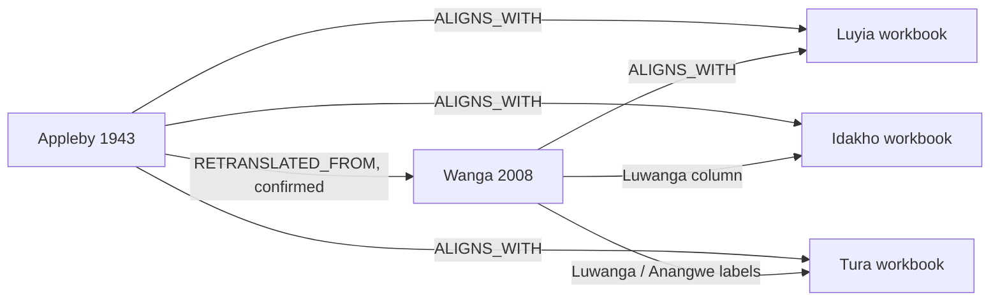

# Michael Marlo Source Intake 001

## Completed outcome

The audit first recorded an incomplete package at commit `67049ca`. After the remaining Wanga, Appleby, and Tura artifacts became available, all 13 expected source files were verified. They contain 12 unique SHA-256 identities because the second Ndanyi Part 5 file is an exact duplicate.

**SOURCE INTAKE VERIFIED — READY FOR SOURCE REGISTRATION / ARTIFACT MODEL DECISION.** This conclusion verifies inventory and import readiness. Rights and dialect questions remain governed review items. No staging or production database writes were made, and no source, source version, contact event, import batch, lexical record, or canonical rule was created.

Original PDFs, workbooks, and private correspondence remain outside Git. The repository-safe record is `config/sources/marlo_source_intake_001.json`.

## Provenance and rights

Private correspondence establishes that Professor Michael R. Marlo shared the source materials on 2026-04-14, contacted Dr. Moody Amakobe about collaboration on 2026-09-25, and received a project reply on 2026-09-27. Only these necessary dates and a concise provenance summary are retained. The correspondence itself is excluded from the repository.

Direct provision establishes acquisition provenance but does not establish an open license. New materials remain `UNKNOWN`. Internal processing, human review, structured derivatives, source excerpts, publication, redistribution, model training, and commercial use require the permissions documented in the manifest.

## Complete inventory findings

| Work or dataset | Physical files | Classification | Parser readiness |
|---|---:|---|---|
| Bukusu-English dictionary, 2008 draft | 1 | Existing work/version; newly supplied binary | Partial |
| Wanga-English dictionary, 2008 draft | 1 | Existing work/version; different binary from reconciled artifact | Partial |
| Appleby, *A Luluhya-English Vocabulary* (1943) | 1 | New historical work | Partial |
| *Luragoli-English Vocabulary* (1940) | 1 | New historical work | Ready with OCR and manual review |
| *Amang’ana go Lulimi lwo Lulogooli* (2005) | 5 components + 1 duplicate | One new work/version, 141 unique pages | Ready with OCR and manual review |
| Luyia comparative workbook | 1 | New dataset, 5,152 rows | Ready |
| Idakho comparative workbook | 1 | New dataset, 4,626 meaningful rows and 5 blanks | Partial |
| Tura/Lutura comparative workbook | 1 | New dataset | Ready; dialect mapping unresolved |

## Wanga and Appleby

The supplied 77-page Wanga PDF is the same semantic 2008 work/version as `WANGA_ENGLISH_DICTIONARY_2008`, but its checksum and size differ from the previously reconciled artifact. Its title page names Alfred Anangwe and Michael R. Marlo, dates the draft 2008-03-02, and records reformatting on 2008-09-01. No new source version is warranted.

Wanga front matter explicitly confirms that an electronic form of Appleby’s 1943 vocabulary was retranslated into Wanga by Alfred Anangwe in 2006, entered electronically, and edited in 2008. This is a `RETRANSLATED_FROM` relationship.

Appleby’s 123-page work is titled *A Luluhya-English Vocabulary*, compiled by L. L. Appleby at C. M. S., Maseno, Kenya, in 1943. The author describes it as tentative and incomplete, largely representing the Hanga group while using broader Luhya orthography. Long-vowel spelling and i/y and u/w usage were explicitly unsettled. It is historical evidence rather than modern pan-Luhya canonical vocabulary.

## Workbook structure

| Workbook | Principal structure |
|---|---|
| Luyia | `AllData`: 5,152 data rows and 14 columns; `Notes`: 2 lines; 5,152 formula cells |
| Idakho | `Sheet1`: 4,626 meaningful rows, 5 blank rows, 9 columns; `Sheet2` and `Sheet3` empty |
| Tura | `AllData`: 4,575 meaningful rows, 1 blank row, 6 columns; `cuts`: 910 rows and 5 columns; `Sheet1` empty |

Tura `AllData` headers are `Appleby 1943`, `Luwanga`, `Lutura`, `POS`, `Gloss`, and an unnamed column. The `cuts` headers are `Appleby 1943`, `Anangwe 2008`, `POS`, `Gloss`, and an unnamed column; the Anangwe data cells are empty. All sheets are visible, with no formulas, merged cells, or comments. Workbook metadata does not resolve Tura/Lutura identity, so expert confirmation remains required.

The three workbooks share a comparative pattern: an Appleby anchor, Luwanga/Wanga material, variety-specific forms, POS, and English glosses. Rows remain source-provided alignments and are not canonical synonym or same-sense assertions.

## Lineage evidence



Workbook column evidence supports `ALIGNS_WITH`; it does not by itself support `DERIVED_FROM`, `REFORMATTED_FROM`, or `RETRANSLATED_FROM`.

## Artifact model decision

**DESIGN SOURCE_ARTIFACTS MIGRATION.** The completed package confirms that import batches cannot cleanly represent immutable file identity and processing execution together. Concrete cases include:

- two identical Part 5 files representing one artifact identity;
- new Bukusu and Wanga binaries for existing source versions;
- five ordered components for one Logoori version;
- a standalone historical PDF;
- workbooks with several sheets and row locators; and
- the same artifact being eligible for later parser runs with different versions or configurations.

A future versioned migration should separate checksum, filename, media type, acquisition, component order, duplicate identity, private archive locator, and source-version relationship from parser execution and output counts.

## Locator conventions

- Spreadsheet: `artifact:{artifact_key}/sheet:{sheet_name}/row:{one_based_row}/column:{column_name}`
- PDF: `artifact:{artifact_key}/part:{component_sequence}/pdf-page:{one_based_pdf_page}/printed-page:{printed_page_or_unknown}/entry:{sequence_on_page}`

## Final questions for Professor Marlo

1. What is the intended distinction between `Idakho_1` and `Idakho_2`?
2. How should Tura/Lutura be classified relative to the Luhya varieties represented in Tafsiri?
3. Do aligned workbook rows assert correspondence only or a stronger analytical relationship?
4. Are the five Ndanyi files the complete ordered scan?
5. May Tafsiri retain and process the files for internal research and human review, and create provenance-linked structured derivatives?
6. May excerpts be shown to authorized reviewers or included in benchmarks and research publications?
7. Which materials may be publicly displayed, redistributed, used for model training, or used in an eventual commercial/API service?
8. Do the supplied Bukusu and Wanga binaries differ substantively from the previously reconciled binaries or only by export/encoding?

## Private archive and validation

Store originals and correspondence in an access-controlled private archive outside Git. Index source artifacts with stable keys, immutable checksums, provider/acquisition metadata, and restricted locators. Keep only manifests, checksums, parser configuration, tests, and reproducibility documentation in Git.

```powershell
$env:UV_CACHE_DIR = (Resolve-Path '.uv-cache').Path
uv run python scripts/source_intake/validate_marlo_intake.py --verify-local-files
uv run --with pytest python -m pytest tests/source_intake/test_marlo_source_intake.py -q
```
