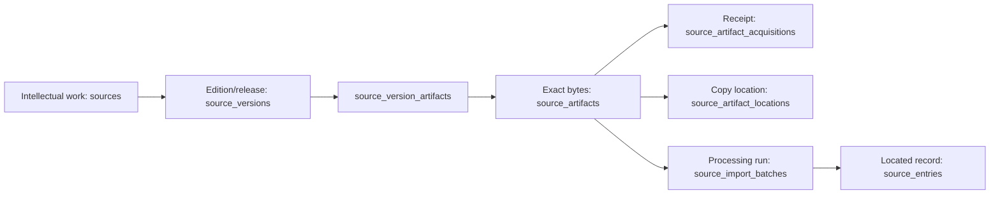

# Tafsiri Source Artifact & Acquisition Architecture 001

## 1. Executive summary

Project Tafsiri should add a content-addressed artifact layer between `source_versions` and `source_import_batches`. An artifact identifies exact bytes. Separate relationships record which source versions those bytes represent, how Tafsiri received them, where copies can be accessed, and how ordered components form a set.

The minimum useful Migration 010 should be additive and contain six new tables plus one nullable foreign-key relationship:

1. `source_artifacts`
2. `source_version_artifacts`
3. `source_artifact_acquisitions`
4. `source_artifact_locations`
5. `source_artifact_sets`
6. `source_artifact_set_members`
7. nullable `source_import_batches.source_artifact_id`, enforced against the batch's `source_version_id`

Do not add worksheet sections, generalized locators, derived-artifact lineage, or historical backfill in Migration 010. These can be added after a demonstrated registration or import requirement.

**Recommendation: READY TO DESIGN MIGRATION 010 SQL.**

## 2. Problem statement

Migration 006 places `original_artifact_name`, `original_artifact_location`, `artifact_checksum`, and `checksum_algorithm` on `source_import_batches`. That preserves useful execution evidence but conflates two questions:

- Which exact bytes does Tafsiri possess?
- Which parser execution processed those bytes?

The Marlo package proves that one source version can have alternate binaries, one binary can be received more than once under different filenames, one source version can consist of ordered components, and one artifact can be processed repeatedly. File identity must therefore exist independently from import execution.

The optional checksum on `source_versions` must remain for compatibility, but new registrations should use artifact identities. It cannot represent multiple binaries for one intellectual version.

## 3. Boundary model



`sources` identifies the intellectual work. `source_versions` identifies a citable edition, release, or draft. `source_artifacts` identifies immutable bytes. `source_import_batches` identifies a parser execution. `source_entries` records located evidence produced by that execution.

## 4. Marlo design cases

| Case | Required representation |
|---|---|
| Bukusu | Existing work/version; a new artifact association and direct-provider acquisition; no new version |
| Wanga | Existing version with two different artifact checksums; both associate to the same version |
| Ndanyi Logoori | Five unique artifact identities in one ordered artifact set; duplicate Part 5 filename becomes a second acquisition of the Part 5 artifact |
| Appleby 1943 | New work/version with one standalone source-representation artifact |
| Friends 1940 | New work/version with one standalone source-representation artifact |
| Luyia workbook | One artifact; sheet/formula inventory remains manifest metadata until imports require it |
| Idakho workbook | One artifact; separate source columns remain parser/schema metadata |
| Tura workbook | One artifact; `AllData`, `cuts`, and empty `Sheet1` remain manifest metadata and future locators |

## 5. Artifact identity model

`source_artifacts` is global and content-addressed. It should not contain `source_version_id`, filename, provider, path, rights, or import fields.

Proposed fields:

| Field | Design |
|---|---|
| `id` | UUID primary key |
| `artifact_key` | Stable human-readable unique key |
| `checksum_algorithm` | Initially only `SHA-256` |
| `checksum` | Canonical lowercase 64-character hexadecimal digest |
| `byte_size` | Nonnegative `bigint` |
| `media_type` | Nonblank IANA media type |
| `artifact_kind` | `SOURCE_REPRESENTATION` or `DERIVED_REPRESENTATION` |
| `page_count` | Optional positive count for page-addressable artifacts |
| `workbook_sheet_count` | Optional nonnegative summary count |
| `artifact_status` | `REGISTERED`, `QUARANTINED`, or `SUPERSEDED` |
| `notes` | Repository-safe administrative notes only |
| `created_at` | Registration time |

The global unique key is `(checksum_algorithm, checksum)`. This makes identical bytes one identity across the registry, not merely within a source version. `source_version_artifacts` provides the many-to-many association needed when an exact artifact legitimately represents more than one registered version or context.

`MISSING` and `AVAILABLE` do not belong in artifact status. An unavailable copy is a location condition, and an expected file without verified bytes is not yet a content-addressed artifact.

## 6. Version association and roles

`source_version_artifacts` should contain:

- `id`
- `source_version_id`
- `source_artifact_id`
- `artifact_role`
- `is_preferred`
- `evidence_reference`
- `notes`
- `created_at`

Initial roles should be `SOURCE_REPRESENTATION`, `RECEIVED_COPY`, `ARCHIVAL_COPY`, `REFORMATTED_COPY`, and `DERIVED_COPY`. Avoid `AUTHORITATIVE` until a governed authority process exists. Role describes the artifact-to-version relationship rather than the bytes themselves.

One `(source_version_id, source_artifact_id)` pair is unique. A partial unique index permits at most one preferred artifact per source version while allowing Wanga artifact A and B to coexist.

## 7. Duplicate handling

Duplicate identity is resolved before insert by checksum. Ndanyi Part 5 and `Part5 (1)` create one `source_artifacts` row, one set membership, and two acquisition rows preserving both received filenames. No `duplicate_of` artifact row is necessary because the acquisition history contains the duplicate event without fabricating a second binary identity.

## 8. Alternate binary handling

Different checksums always create different artifact identities, even when semantic content appears identical. The Wanga reconciled PDF and Marlo-provided PDF both associate with `WANGA_ENGLISH_DICTIONARY_2008 / PRELIMINARY_DRAFT_2008`. The acquisition channel and binary difference do not create a source version.

## 9. Multipart work model

Each Ndanyi PDF is an artifact. `source_artifact_sets` groups the five components for the 2005 version; `source_artifact_set_members` supplies deterministic ordering.

`source_artifact_sets` fields:

- `id`, `source_version_id`, `artifact_set_key`, `set_type`, `label`, `notes`, `created_at`
- initial `set_type`: `MULTIPART_DOCUMENT`, `VOLUME_SET`, `SCAN_SECTION_SET`, `CORPUS_PACKAGE`, `AUDIO_COLLECTION`, `OTHER`

`source_artifact_set_members` fields:

- `artifact_set_id`, `source_artifact_id`, `component_sequence`, optional `component_label`, optional `member_role`, `created_at`

The set owns ordering, so the same content identity does not acquire a universal part number. Unique constraints on `(artifact_set_id, source_artifact_id)` and `(artifact_set_id, component_sequence)` prevent duplicate members and ambiguous order. Sets add concrete value for the five-part scan and remain small enough for Migration 010.

## 10. Workbook and section model

Do not add `source_artifact_sections` in Migration 010. Workbook sheet inventories are reproducible manifest or parser-configuration metadata. Future `source_entries.original_entry_locator` values can name the sheet, row, and column.

Add a sections table later only if Tafsiri must govern reusable sheet, archive-member, audio-track, or page-range identities independently from entries and parser configurations. The current three workbooks do not require that abstraction.

## 11. Acquisition model

`source_artifact_acquisitions` represents possession or receipt, separately from communication and storage.

Proposed fields:

- `id`, `source_artifact_id`, `acquisition_key`
- `acquisition_type`: `DIRECT_RESEARCHER_PROVISION`, `PUBLIC_DOWNLOAD`, `INSTITUTIONAL_TRANSFER`, `PROJECT_GENERATED`, `OTHER`
- `acquired_at` nullable timestamp/date
- `provided_by_contributor_id` nullable FK to `contributors`
- `provider_display_name` nullable fallback
- `source_contact_event_id` nullable FK
- `original_filename` nullable
- `acquisition_group_key` nullable, such as `MARLO_SOURCE_INTAKE_001`
- `evidence_reference`, `notes`, `created_at`

Require at least one provider identity for direct provision, but do not require a Tafsiri authentication account. `contributors` already models human identity independently of application users. Store no email body or private headers.

Contact and acquisition rows coexist. A contact event records communication and permissions discussion; an acquisition records receipt of exact bytes. The optional contact-event FK connects them without implying rights.

## 12. Artifact location model

`source_artifact_locations` records accessible copies separately from content identity:

- `id`, `source_artifact_id`, `location_key`
- `storage_class`: `PRIVATE_ARCHIVE`, `OBJECT_STORAGE`, `PUBLIC_URL`, `INSTITUTIONAL_REPOSITORY`, `LOCAL_RESEARCH_ARCHIVE`
- portable `location_reference`
- `availability_status`: `AVAILABLE`, `UNAVAILABLE`, `RESTRICTED`, `UNKNOWN`
- `is_primary`, first/last verified times, notes, `created_at`, `updated_at`

Private locations use opaque archive keys or object identifiers, never machine-specific filesystem paths or credentials. URLs and availability may change without changing the artifact. A partial index should allow only one primary location per artifact and storage class.

## 13. Rights and access

Copyright and permitted uses remain primarily on `source_versions` through `source_rights` and `source_use_policies`. Artifact location and storage policy answer who can retrieve a copy, not what uses copyright permits.

The researcher-provided Wanga copy can stay in `PRIVATE_ARCHIVE` while another location is a `PUBLIC_URL`. Neither location changes the source-version rights assessment. Direct provision creates acquisition provenance only.

## 14. Derived artifacts

OCR text, normalized text, page images, parsed JSON, CSV, and extracted audio can later be registered as content-addressed artifacts with `artifact_kind = DERIVED_REPRESENTATION`. Their intellectual source version remains unchanged.

Do not add a single `parent_artifact_id`: combined outputs may derive from several component artifacts. Defer a many-to-many `source_artifact_derivations(derived_artifact_id, parent_artifact_id, derivation_type, tool/version/config evidence)` table until the first governed derived artifact registration. ADR-027 preserves this direction without prematurely fixing the schema.

## 15. Locator implications

Keep locators on `source_entries.original_entry_locator` using deterministic conventions:

- PDF: `artifact:{artifact_key}/part:{sequence}/pdf-page:{page}/printed-page:{printed_or_unknown}/entry:{sequence}`
- Workbook: `artifact:{artifact_key}/sheet:{sheet}/row:{row}/column:{column}`

A generalized locator table is deferred. Entry locators are execution outputs and already have uniqueness within an import batch. Parser configuration should define escaping and normalization rules.

## 16. Import-batch relationship

Choose option **A**: add nullable `source_artifact_id` to `source_import_batches`.

Add `UNIQUE (id, source_version_id)` to `source_version_artifacts` if needed for association identity, and enforce the batch relationship through a composite FK or an association FK so the referenced artifact is registered for the same source version. A direct artifact FK without version consistency is insufficient.

Existing Migration 006 execution fields remain useful: batch key, import method, tool/version, transformation specification, configuration hash, normalization version, executor, timestamp, counts, and notes. Existing artifact-name/location/checksum columns remain unchanged for compatibility. New batch tooling should populate `source_artifact_id` and verify that the legacy checksum snapshot equals the linked artifact checksum.

Output checksum, execution status, and richer transformation-policy fields should be designed with the next import-governance requirement rather than added to this artifact foundation without a consumer.

## 17. Historical compatibility and backfill

The new batch FK is nullable. Existing imports and entries remain valid. Migration 010 performs no data rewrite and does not alter the seven original registered sources, 46 scholarly sources, rights, policies, evidence, rules, or legacy reconciliation state.

No automatic backfill is allowed. Link a historical batch only when its stored checksum and source-version association prove exact identity. Uncertain batches remain null until controlled reconciliation. Do not infer identity from filename, URL, title, or similar row counts.

## 18. Immutability

Once registered, `checksum_algorithm`, `checksum`, `byte_size`, and `media_type` are immutable. A changed file creates a new artifact. Migration 010 should use a `BEFORE UPDATE` trigger that rejects changes to identity fields while allowing governed status and note updates. Application convention alone is insufficient for this invariant.

## 19. Security and RLS

All new public-schema tables start with RLS enabled and no policies. Revoke every table privilege from `anon` and `authenticated`; grant administrative privileges only to `service_role`. Reviewer Portal access remains absent. Public serving, if later approved, should use separate reviewed projections rather than exposing governance tables.

Do not place signed URLs, storage credentials, local paths, private correspondence, or permission documents in these tables. Store opaque references to protected systems.

## 20. Proposed key constraints

- Global unique `(checksum_algorithm, checksum)` on artifacts
- SHA-256 lower-hex format and nonnegative byte-size checks
- Positive PDF page count; nonnegative workbook sheet count
- Unique `artifact_key`
- Unique `(source_version_id, source_artifact_id)` association
- At most one preferred version artifact per source version
- Unique acquisition key; nonblank original filename when present
- Provider required for direct-researcher acquisition
- Unique `(source_artifact_id, location_key)`
- Portable, nonblank location reference; reject common absolute-path patterns in application validation
- Unique artifact-set key per version
- Unique set member and sequence constraints
- Artifact-set members must be associated with the set's source version, enforced with composite keys
- Import-batch artifact association must match batch source version
- `ON DELETE RESTRICT` for provenance relationships

## 21. Proposed indexes

- Artifact checksum global unique index
- `source_version_artifacts(source_version_id)` and `(source_artifact_id)`
- Partial preferred-artifact index on `source_version_id WHERE is_preferred`
- Acquisitions on `source_artifact_id`, `provided_by_contributor_id`, and `acquisition_group_key`
- Locations on `source_artifact_id`, plus partial primary-location index
- Artifact sets on `source_version_id`
- Set members on `source_artifact_id`
- Partial import-batch index on `source_artifact_id WHERE source_artifact_id IS NOT NULL`

Every foreign-key column used for parent deletion checks or ordinary joins receives a supporting index.

## 22. Deferred structures

Defer:

- `source_artifact_sections`
- reusable generalized locator entities
- `source_artifact_derivations`
- checksum backfill into artifacts
- removal of Migration 006 artifact snapshot columns
- public artifact-serving policies
- reviewer access
- import output/status expansion

## 23. First Marlo registration flow

```text
reuse or register source
→ reuse or register source version
→ resolve artifact globally by SHA-256
→ associate artifact with source version and role
→ record each receipt/acquisition and filename
→ record private/public locations
→ create an ordered set for Ndanyi parts
→ register source-version rights and use policies
→ stop before import batches and source entries
```

The Part 5 duplicate resolves to the existing artifact and adds an acquisition. Bukusu and Wanga reuse existing versions. No acquisition action modifies rights.

## 24. Future import flow

```text
registered artifact association
→ immutable parser/config selection
→ source_import_batch linked to artifact
→ deterministic source_entries with artifact-aware locators
→ reviewed dialect assertions and lexical candidates
→ separately governed canonical promotion
```

Each parser run creates a new batch. Prior executions and their outputs are never overwritten.

## 25. Canonical lexical provenance

The intended provenance path becomes:

```text
canonical lexical sense
→ supporting lexical candidate/evidence
→ source entry
→ import batch
→ exact source artifact
→ source version
→ intellectual source
```

This lets Tafsiri explain which bytes, parser, configuration, location, edition, and work support a future Lexeme → Form → Sense → Concept assertion. Artifact registration does not promote any source claim into canonical knowledge.

## 26. Architecture decisions

### ADR-021: Artifact identity is distinct from source version

**Decision:** A source version identifies an intellectual edition or release. A source artifact identifies exact bytes. Their many-to-many association preserves alternate binaries and shared representations without fabricating versions.

### ADR-022: Artifact identity is content-addressed

**Decision:** Artifact identity is globally unique by checksum algorithm and canonical digest. SHA-256 is the initial required algorithm. Filenames, providers, locations, and roles do not define identity.

### ADR-023: Acquisition does not imply rights

**Decision:** Receipt of an artifact is recorded independently from copyright evidence and use-policy decisions. Direct researcher provision grants no permission by itself.

### ADR-024: Import execution is distinct from artifact identity

**Decision:** Every processing execution is an append-only import batch referencing a registered artifact association. Reprocessing creates a new batch and preserves prior history.

### ADR-025: Duplicate binaries share artifact identity

**Decision:** Identical checksums resolve to one artifact. Multiple filenames, receipt events, and locations remain visible through acquisition and location records.

### ADR-026: Alternate binaries may belong to the same source version

**Decision:** Different checksums create separate artifacts and may associate with one source version. A changed binary does not alone create an intellectual version.

### ADR-027: Derived artifacts preserve parent lineage

**Decision:** Machine-produced representations are artifacts distinct from source representations and must preserve all parent artifacts plus derivation tool/configuration evidence. A future many-to-many derivation relation will implement this when required.

### ADR-028: Artifact storage location is not artifact identity

**Decision:** Locations are mutable access records linked to immutable artifact identity. Portable references replace private filesystem paths, and location availability does not define copyright permission.

## 27. Open questions for SQL design review

1. Should Migration 010 permit only SHA-256 or allow an algorithm lookup while requiring SHA-256 for new registrations?
2. Should `artifact_status = SUPERSEDED` be retained, given that alternate artifacts should normally coexist rather than supersede one another?
3. Should acquisition time use `date` for uncertain historical receipts or `timestamptz` plus a precision field?
4. Should location references be opaque text or split public URL and private archive key columns?
5. Should the preferred-artifact rule allow one preferred artifact per role rather than one per version?
6. Which service process may change quarantine/status fields after registration?

## 28. Minimum Migration 010 scope

Create the six tables listed in the executive summary, their checks, composite provenance constraints, indexes, immutability trigger, RLS posture, grants, and table/column comments. Add only the nullable, version-consistent artifact relationship to `source_import_batches`. Insert no data and perform no backfill.

Migration 010 SQL, registration data, and parser/import changes remain separate reviewable tasks.

## 29. Database safety

This architecture task performed zero production writes and zero staging writes. It creates no migration, table, source, source version, artifact, acquisition, import batch, entry, lexical record, evidence promotion, or canonical rule.

## 30. Final recommendation

**READY TO DESIGN MIGRATION 010 SQL**
