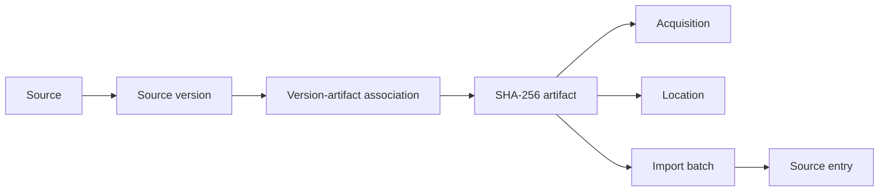

# Technical architecture

Project Tafsiri is a monorepo for dialect-aware research, source governance, human review, canonical knowledge, and future language technology. PostgreSQL/Supabase is the schema authority; applied migrations, constraints, policies, and grants define the deployed model.

## Architectural boundaries

The system separates source and rights governance, artifact and import lineage, located evidence, human review and canonical promotion, and derived datasets/models/runtime. No layer automatically promotes content into the next.

## Deployed migration sequence

| Migration | Deployed responsibility |
|---|---|
| Baseline | Legacy language tables, canonical concepts, candidate generation, evaluation, and reviewer workflows |
| 006 | Sources, versions, rights, use policies, contacts, import batches, and source entries |
| 007 | Linguistic evidence types, locators, notation, examples, dialect scope, relations, provenance, and verification |
| 008 | Scholarly book source-type support |
| 009 | Canonical linguistic rules, revisions, evidence links, dialect scope, promotions, outputs, and bounded authority |
| 010 | Source artifacts, acquisitions, locations, associations, sets, members, and artifact-aware import lineage |

The Canonical Lexical Core is the next architecture milestone. Migration 011 does not yet exist.

## Source and artifact lineage

This supports alternate binaries for one version, repeated receipt of identical bytes, multipart works, and reproducible parsing. Artifact identity is immutable; acquisitions and locations describe receipt and access without redefining it.

The Marlo registration is deployed in staging and production: 59 sources, 59 versions, 12 artifacts, 12 associations, 13 acquisitions, one set, five members, 59 current rights records, and 472 current use policies. The package has no import batches or source entries.

## Linguistic evidence and canonical rules

Located assertions retain source/version provenance, locators, extraction method, notation, dialect scope, review state, and reviewer attribution. Human verification confirms representation of a source; it does not create a canonical rule.

Canonical Promotion Pilot 001 produced four `PROVISIONAL` rules in staging and production. They have no runtime projection and are not executable serving behavior.

## Canonical Lexical Core

The next planned layer is `Lexeme → Form → Sense → Concept`. It will keep attestations separate from canonical objects and support homographs, polysemy, dialect and historical forms, variants, concepts, disputes, and explicit review state. Legacy dictionary and concept rows must not be relabeled as canonical lexical truth without governed migration and review.

## Reviewer Portal

`apps/reviewer-portal/` is a Next.js, React, and TypeScript research application using Supabase Auth, PostgreSQL, and Row-Level Security. It supports onboarding, participation, assignments, blinded review, deterministic resume behavior, withdrawal, and administrative controls. It is not a public translation runtime and does not directly promote annotations.

## Candidate generation and evaluation

`scripts/candidate_generation/` and `config/candidate_generation/` produce research proposals with provenance. `evaluation/` contains frozen packages, manifests, hashes, and pipeline snapshots that must not be rewritten during maintenance.

## Environments and deployment

Local, staging, and production use separate configuration and Supabase projects. The staging Vercel project serves the Reviewer Portal from `apps/reviewer-portal/`. Secrets belong in ignored environment files or hosting configuration.

Database changes are new versioned files under `supabase/migrations/`. Applied migrations are never rewritten, and existing tables are never dropped or destructively changed without explicit approval.

## Security model

- Browser clients use publishable credentials and Row-Level Security.
- Administrative operations use trusted server or CLI paths with environment guards.
- Privileged portal clients are server-only and require administrator authorization.
- Registration and promotion tools default to validation or dry-run and write atomically.
- Source receipt, review, or canonical status never grants client access automatically.

## Technology and verification

The repository uses PostgreSQL/Supabase, pgvector in the legacy knowledge schema, Next.js, React, TypeScript, Python, Supabase Auth, Row-Level Security, GitHub Actions, Vercel, and SHA-256 artifact addressing.

CI runs portal type checking, lint, tests, and build; Python regressions; a clean local Supabase migration reset; SQL smoke/security tests; atomic registration integration tests; and database lint. Governed operations additionally record dry-run plans, semantic digests, environment guards, idempotency, parity, advisors, and execution artifacts.
